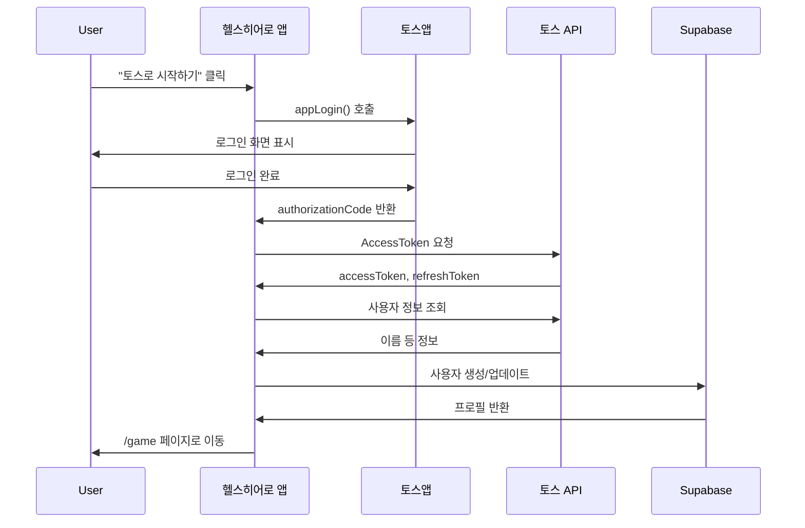

# 🔐 토스 로그인 구현 완료 ✅

토스 로그인 시스템이 성공적으로 구현되었습니다!

**구현 완료일**: 2024-01-20  
**구현 방식**: 서버리스 (Supabase + 클라이언트 직접 호출)  
**보안**: Client Secret 불필요, mTLS 불필요 (기본 로그인)

## ✅ 구현된 기능

### 1. 토스 인증
- ✅ `appLogin()` 을 통한 인가 코드 받기
- ✅ AccessToken 발급
- ✅ 사용자 정보 조회 (이름)
- ✅ 토큰 저장 및 관리
- ✅ 토큰 자동 갱신 기능

### 2. Supabase 연동
- ✅ 사용자 프로필 테이블 (`user_profiles`)
- ✅ 로그인 기록 테이블 (`toss_login_logs`)
- ✅ Row Level Security (RLS) 정책
- ✅ 사용자 자동 생성/업데이트

### 3. 상태 관리
- ✅ Zustand를 사용한 인증 상태 관리
- ✅ 사용자 프로필 캐싱
- ✅ 세션 지속성 (localStorage)

### 4. UI 컴포넌트
- ✅ 토스 로그인 버튼
- ✅ 로딩 상태 표시
- ✅ 에러 메시지 표시
- ✅ 개발 환경 안내

### 5. 에러 처리
- ✅ 토스 API 에러 핸들링
- ✅ 네트워크 에러 처리
- ✅ 사용자 친화적 메시지

---

## 📁 생성된 파일 구조

```
health-hero/
├── src/
│   ├── lib/
│   │   └── supabase.ts                    # Supabase 클라이언트
│   ├── types/
│   │   ├── toss.ts                        # 토스 관련 타입
│   │   └── database.ts                    # 데이터베이스 타입
│   ├── utils/
│   │   ├── tokenManager.ts                # 토큰 관리
│   │   └── errorHandler.ts                # 에러 처리
│   ├── hooks/
│   │   └── useTossAuth.ts                 # 토스 인증 훅
│   ├── services/
│   │   └── tossAuthService.ts             # Supabase 연동
│   ├── store/
│   │   └── authStore.ts                   # 인증 상태 관리
│   ├── components/
│   │   └── TossLoginButton.tsx            # 로그인 버튼
│   └── app/
│       └── page.tsx                       # 메인 페이지 (업데이트)
├── supabase/
│   ├── schema.sql                         # DB 스키마
│   └── README.md                          # Supabase 설정 가이드
├── docs/
│   ├── TOSS_LOGIN_SETUP.md               # 설정 가이드
│   └── Toss.md                           # 상세 가이드 (기존)
└── .env.local.example                     # 환경 변수 예시
```

---

## 🚀 빠른 시작

### 1단계: 환경 변수 설정

`.env.local` 파일을 생성하고 다음 값을 입력:

```bash
# Supabase (Supabase 콘솔 > Project Settings > API에서 확인)
NEXT_PUBLIC_SUPABASE_URL=your_supabase_url
NEXT_PUBLIC_SUPABASE_ANON_KEY=your_supabase_anon_key

# 토스 앱인토스 (앱인토스 콘솔 > 개발 > 토스 로그인에서 확인)
NEXT_PUBLIC_TOSS_CLIENT_ID=your_toss_client_id
NEXT_PUBLIC_TOSS_APP_KEY=health-hero

# ℹ️ Client Secret은 현재 토스 로그인 플로우에서 사용하지 않습니다.
# authorizationCode와 referrer만으로 안전하게 토큰을 발급받습니다.
```

### 2단계: Supabase 데이터베이스 설정

1. Supabase 콘솔 > **SQL Editor** 이동
2. `supabase/schema.sql` 파일 내용 복사
3. SQL Editor에 붙여넣고 **Run** 클릭

### 3단계: 로컬 개발 서버 실행

```bash
npm run dev
```

브라우저에서 `http://localhost:5173` 접속

### 4단계: 샌드박스 앱 테스트

```bash
npm run build
```

앱인토스 콘솔에서 `.ait` 파일 업로드 후 테스트

---

## 📚 상세 문서

- **[TOSS_LOGIN_SETUP.md](docs/TOSS_LOGIN_SETUP.md)** - 설정 및 테스트 가이드
- **[Toss.md](docs/Toss.md)** - 토스 로그인 완전 가이드
- **[Supabase README](supabase/README.md)** - Supabase 설정 상세

---

## 🔄 로그인 플로우



---

## 🎯 주요 기능 사용법

### 로그인 상태 확인

```typescript
import { useAuthStore } from '@/store/authStore'

function MyComponent() {
  const { user, isAuthenticated } = useAuthStore()
  
  if (!isAuthenticated) {
    return <div>로그인이 필요합니다</div>
  }
  
  return <div>환영합니다, {user?.name}님!</div>
}
```

### 사용자 프로필 업데이트

```typescript
import { useAuthStore } from '@/store/authStore'

function UpdateProfile() {
  const { updateProfile } = useAuthStore()
  
  const handleLevelUp = () => {
    updateProfile({
      level: user.level + 1,
      current_exp: 0
    })
  }
}
```

### 로그아웃

```typescript
import { useAuthStore } from '@/store/authStore'

function LogoutButton() {
  const { logout } = useAuthStore()
  
  return (
    <button onClick={logout}>
      로그아웃
    </button>
  )
}
```

---

## 🐛 트러블슈팅

### 자주 발생하는 문제

1. **"앱인토스 환경에서만 사용할 수 있습니다"**
   - 샌드박스 앱 또는 토스앱에서 테스트 필요
   - 로컬 환경에서는 `appLogin()` 함수가 없음

2. **"Missing Supabase environment variables"**
   - `.env.local` 파일 확인
   - 개발 서버 재시작

3. **토큰 발급 실패**
   - Client ID, Secret 재확인
   - 앱인토스 콘솔에서 토스 로그인 활성화 확인

자세한 내용은 [TOSS_LOGIN_SETUP.md](docs/TOSS_LOGIN_SETUP.md#트러블슈팅)를 참고하세요.

---

## 📊 서버리스 아키텍처 확인

### ✅ 서버 없이 가능한 기능 (현재 구현)

```
브라우저 (클라이언트)
    ├─→ 토스 API (직접 호출)
    │    └─ 로그인, 토큰 발급, 사용자 정보
    │
    └─→ Supabase (직접 호출)
         └─ 사용자 프로필, 게임 데이터, RLS 보안
```

**가능한 것:**
- ✅ 토스 로그인
- ✅ 게임 진행 상태 저장
- ✅ 점수/레벨 시스템
- ✅ **광고 (하트 충전)** - 앱인토스/AdMob SDK
- ✅ 리더보드
- ✅ 사용자 통계

**필요 없는 것:**
- ❌ 백엔드 서버
- ❌ Client Secret
- ❌ mTLS 인증서

### ⚠️ 서버가 필요한 경우 (미래)

**다음 기능 추가 시:**
- 토스 페이 결제
- 인앱 결제
- 푸시 알림 발송
- 토스 포인트 프로모션

→ 그때 `docs/MTLS_GUIDE.md` 참고

---

## 🎉 다음 단계

토스 로그인이 완료되었습니다! 이제 다음 기능을 개발할 수 있습니다:

### Phase 1: 게임 로직 구현 (서버 불필요)
- 퀴즈 시스템
- 점수 계산
- 레벨업 시스템
- 광고 연동 (하트 충전)

### Phase 2: UI/UX 개선 (서버 불필요)
- 프로필 페이지
- 게임 진행 상황
- 통계 및 리더보드

### Phase 3: 고급 기능 (선택적 서버 필요)
- 토스 페이 결제 (mTLS 필요)
- 푸시 알림 (mTLS 필요)
- 프로모션 (mTLS 필요)

---

**구현 완료일**: 2024-01-20  
**개발자**: Health Hero Development Team  
**문의**: 프로젝트 이슈 트래커

