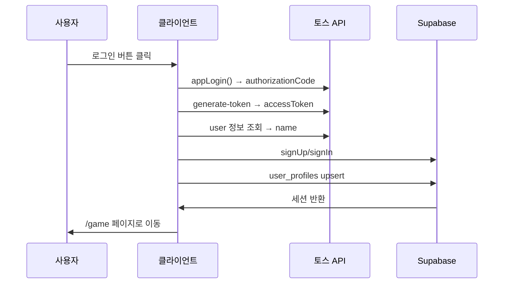
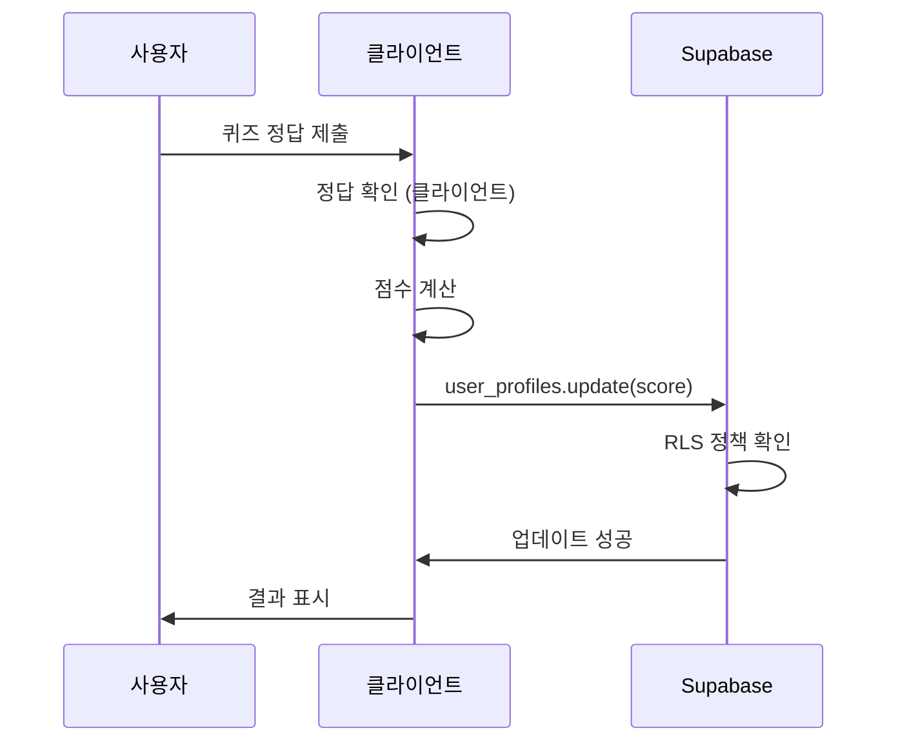
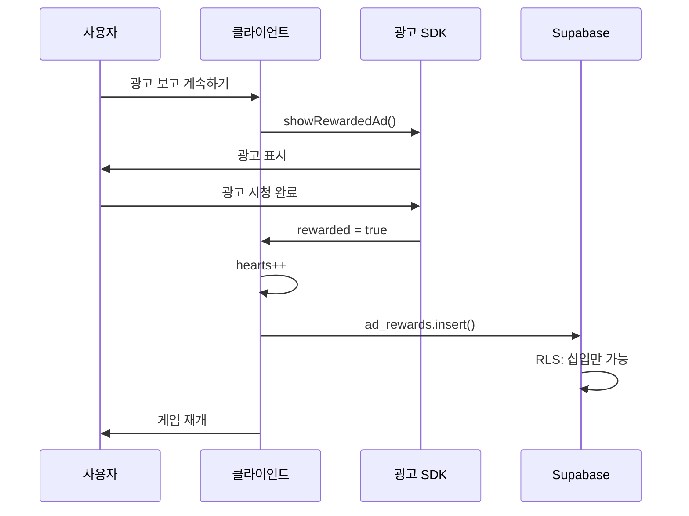

# 🏗️ 헬스 히어로 아키텍처

## 📋 목차

1. [전체 아키텍처](#전체-아키텍처)
2. [서버리스 설계](#서버리스-설계)
3. [데이터 흐름](#데이터-흐름)
4. [보안 메커니즘](#보안-메커니즘)
5. [확장 가능성](#확장-가능성)

---

## 🎯 전체 아키텍처

### 서버리스 (Serverless) 구조

```
┌─────────────────────────────────────────────────────┐
│                  사용자 (브라우저)                    │
│                                                       │
│  ┌─────────────────────────────────────────────┐   │
│  │         Next.js 15 (Static Export)          │   │
│  │  • App Router                               │   │
│  │  • React 19                                 │   │
│  │  • Zustand (상태 관리)                       │   │
│  │  • Phaser 3 (게임 엔진)                     │   │
│  └─────────────────────────────────────────────┘   │
└───────────┬─────────────────────────┬───────────────┘
            │                         │
            │ HTTPS                   │ HTTPS
            │                         │
    ┌───────▼────────┐        ┌──────▼──────┐
    │   토스 API     │        │  Supabase   │
    │  (앱인토스)     │        │             │
    │                │        │ PostgreSQL  │
    │ • 토스 로그인   │        │ + Auth      │
    │ • 토큰 발급    │        │ + RLS       │
    │ • 사용자 정보   │        │             │
    └────────────────┘        └─────────────┘
```

**특징:**
- ✅ **백엔드 서버 없음**
- ✅ 클라이언트가 직접 외부 API 호출
- ✅ Supabase가 데이터베이스 + 인증 + API 제공
- ✅ 완전한 정적 사이트 (Static Export)

---

## 🎨 서버리스 설계

### 1. 인증 (Authentication)

```
사용자
  │
  │ 1. 로그인 버튼 클릭
  ▼
appLogin() (앱인토스 SDK)
  │
  │ 2. authorizationCode 반환
  ▼
fetch('토스 API') ← 클라이언트에서 직접 호출!
  │
  │ 3. accessToken 반환
  ▼
supabase.auth.signUp() ← 클라이언트에서 직접 호출!
  │
  │ 4. Supabase 세션 생성
  ▼
user_profiles 테이블에 저장 (RLS로 보호)
```

**포인트:**
- 모든 단계가 클라이언트에서 실행
- 서버 불필요
- Client Secret 불필요

### 2. 데이터 저장 (Database)

```
사용자 액션 (점수 획득, 레벨업 등)
  │
  │ 클라이언트에서 계산
  ▼
supabase.from('user_profiles').update(...)
  │
  │ RLS 정책 자동 적용
  ▼
PostgreSQL (Supabase)
```

**보안:**
```sql
-- 사용자는 자신의 데이터만 수정 가능
CREATE POLICY "Users can update own profile"
  ON user_profiles
  FOR UPDATE
  USING (auth.uid() = id);
```

### 3. 광고 (Advertising)

```
하트 0 → 컨티뉴 모달
  │
  │ "광고 보고 계속하기" 클릭
  ▼
앱인토스 광고 SDK / AdMob SDK
  │
  │ 광고 시청 완료
  ▼
클라이언트에서 보상 처리
  │
  │ hearts++
  ▼
supabase.from('ad_rewards').insert(...)
  │
  │ RLS로 조작 방지
  ▼
게임 재개
```

**특징:**
- SDK만으로 광고 표시
- 서버 검증 불필요 (RLS로 대체)
- 클라이언트에서 완결

---

## 🔄 데이터 흐름

### 로그인 플로우



### 게임 플레이 플로우



### 광고 보상 플로우



---

## 🛡️ 보안 메커니즘

### 1. 토스 로그인 보안

**계층적 보안:**
1. **앱인토스 콘솔 등록** - 등록된 앱만 SDK 사용
2. **토스앱 내부 실행** - 일반 브라우저에서 호출 불가
3. **인가 코드 제한** - 10분 유효, 1회용
4. **토큰 만료** - AccessToken 1시간 후 만료

**결과:**
- Client Secret 불필요
- mTLS 불필요 (기본 기능)
- 충분히 안전

### 2. Supabase Row Level Security (RLS)

```sql
-- 예시 1: 읽기 제한
CREATE POLICY "Users can view own profile"
  ON user_profiles
  FOR SELECT
  USING (auth.uid() = id);

-- 예시 2: 쓰기 제한
CREATE POLICY "Users can update own profile"
  ON user_profiles
  FOR UPDATE
  USING (auth.uid() = id);

-- 예시 3: 광고 조작 방지
CREATE POLICY "Users can insert own ad rewards"
  ON ad_rewards
  FOR INSERT
  WITH CHECK (auth.uid() = user_id);

-- 수정/삭제 불가
CREATE POLICY "No updates allowed"
  ON ad_rewards
  FOR UPDATE
  USING (false);
```

**효과:**
- ✅ 사용자 A는 사용자 B 데이터 접근 불가
- ✅ 점수 조작 불가
- ✅ 광고 보상 중복 불가
- ✅ anon key 노출되어도 안전

### 3. 클라이언트 검증

```typescript
// 클라이언트에서 기본 검증
const validateAnswer = (answer: string, correct: string) => {
  return answer === correct
}

// Supabase에 저장 (RLS가 추가 보안)
await supabase
  .from('user_profiles')
  .update({ score: score + 10 })
  .eq('id', user.id)
```

**한계:**
- ⚠️ 클라이언트 코드는 조작 가능
- ⚠️ 중요한 검증은 미래에 서버 필요

**현재 대응:**
- RLS로 최소 보안 유지
- 게임은 경쟁보다 학습 중심
- 리더보드는 참고용

---

## 🚀 확장 가능성

### Phase 1: 현재 (서버리스) ✅

```
구조: 클라이언트 → 외부 API

가능:
✅ 토스 로그인
✅ 게임 플레이
✅ 데이터 저장
✅ 광고 (하트 충전)
✅ 리더보드

비용: $0/월
```

### Phase 2: 미래 (하이브리드)

```
구조: 클라이언트 → Next.js API Routes → 외부 API

추가:
✅ 토스 페이 결제
✅ 인앱 결제
✅ 푸시 알림
✅ 정교한 부정 방지

필요:
⚠️ mTLS 인증서
⚠️ API Routes 구현
⚠️ 서버 배포

비용: $20/월 (Vercel Pro)
```

### Phase 3: 완전 서버 (선택)

```
구조: 클라이언트 → 전용 백엔드 → 외부 API

추가:
✅ 실시간 멀티플레이
✅ 관리자 대시보드
✅ 고급 분석
✅ 완벽한 보안

필요:
⚠️ Node.js 서버
⚠️ 데이터베이스 마이그레이션
⚠️ 인프라 관리

비용: $50+/월
```

---

## 📊 기술 스택

### Frontend
```
- Framework: Next.js 15.5.5
- Runtime: React 19
- Language: TypeScript
- State: Zustand 5.0.8
- Styling: Tailwind CSS 4
- Game: Phaser 3.90.0
- Animation: Framer Motion
```

### Backend (서버리스)
```
- Database: Supabase PostgreSQL
- Auth: Supabase Auth
- API: Supabase REST API
- Storage: Supabase Storage (미래)
```

### External APIs
```
- Login: 앱인토스 (토스)
- Ads: 앱인토스/AdMob
```

### Deployment
```
- Frontend: Vercel (Static)
- Backend: Supabase
- CDN: Vercel Edge Network
```

---

## 🎯 설계 원칙

### 1. 서버리스 우선
- 가능한 한 서버 없이 구현
- 비용 최소화
- 관리 부담 최소화

### 2. 점진적 확장
- 필요할 때 서버 추가
- 기존 코드 유지
- 단계적 마이그레이션

### 3. 보안 우선
- RLS로 데이터 보호
- 클라이언트 검증 + 서버 검증
- 민감한 데이터는 서버 처리

### 4. 사용자 경험
- 빠른 로딩
- 오프라인 지원 (PWA)
- 반응형 디자인

---

## 📚 참고 문서

- [README_TOSS_LOGIN.md](../README_TOSS_LOGIN.md) - 토스 로그인 개요
- [TOSS_LOGIN_SETUP.md](./TOSS_LOGIN_SETUP.md) - 설정 가이드
- [SECURITY_FAQ.md](./SECURITY_FAQ.md) - 보안 FAQ
- [MTLS_GUIDE.md](./MTLS_GUIDE.md) - 미래 확장 가이드
- [PROJECT.md](./PROJECT.md) - 프로젝트 전체 구조

---

**Last Updated**: 2024-01-20  
**Architecture**: Serverless (Supabase + 클라이언트)  
**Status**: Production Ready ✅

