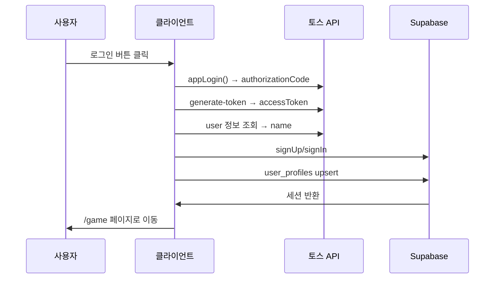
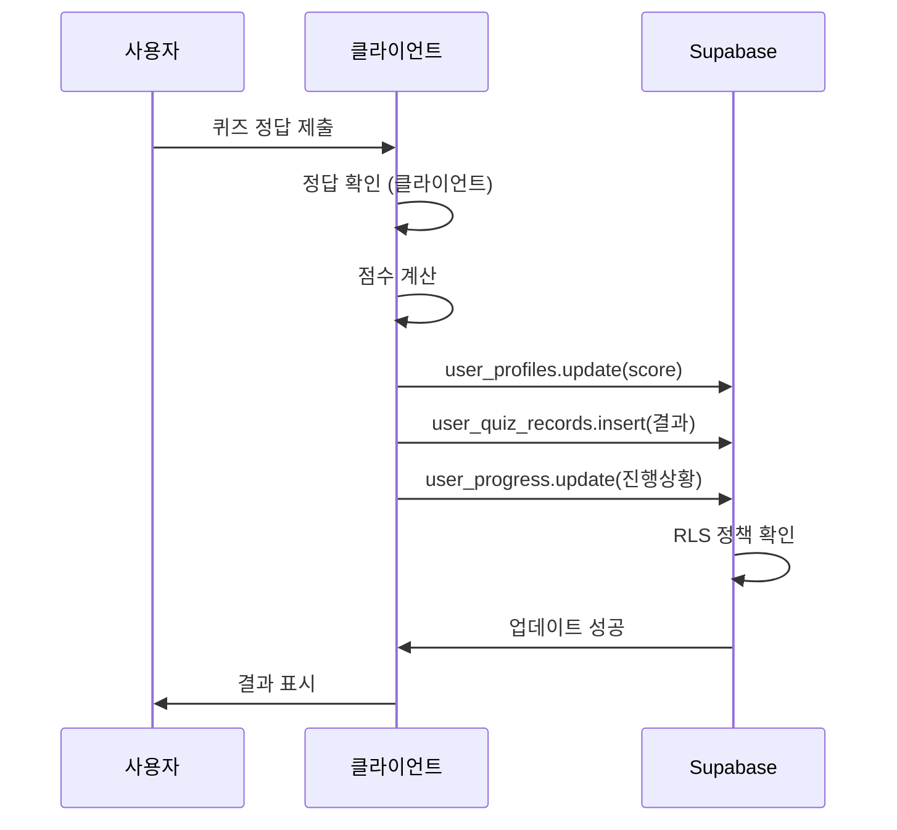
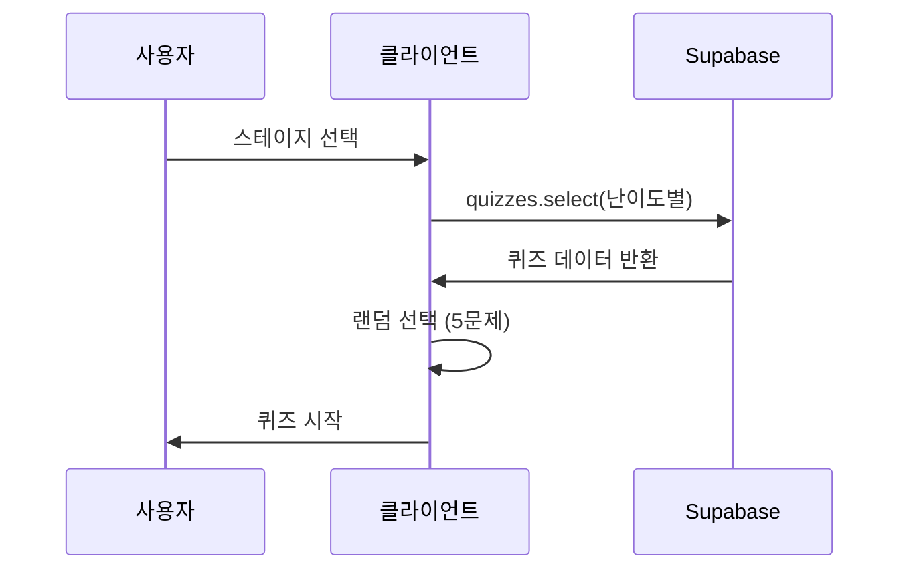
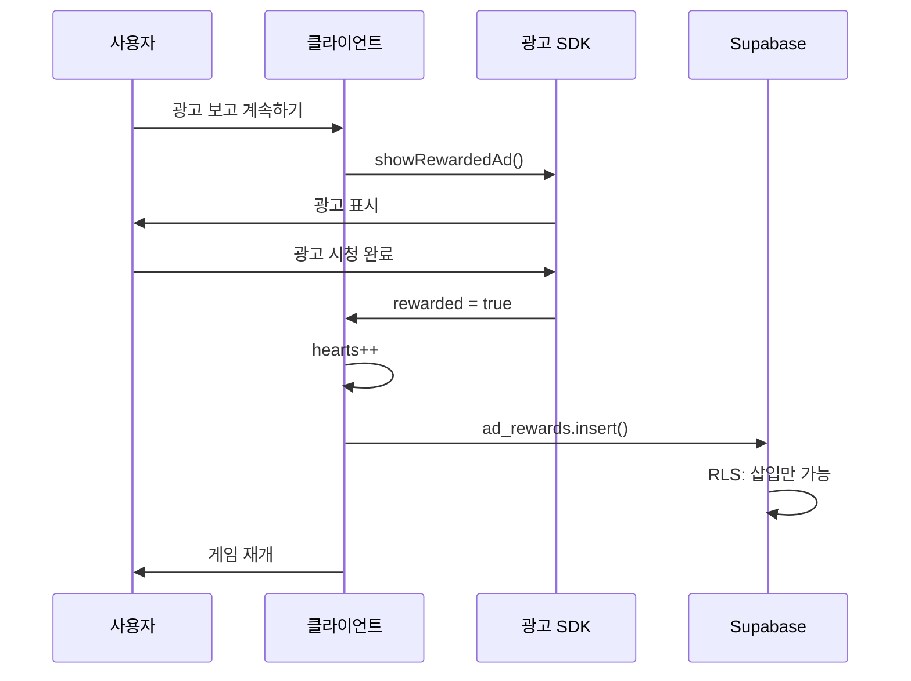

# 🏗️ 헬스 히어로 아키텍처

## 📋 목차

1. [전체 아키텍처](#전체-아키텍처)
2. [서버리스 설계](#서버리스-설계)
3. [데이터 흐름](#데이터-흐름)
4. [보안 메커니즘](#보안-메커니즘)
5. [확장 가능성](#확장-가능성)

---

## 🎯 전체 아키텍처

### 서버리스 (Serverless) 구조

```
┌─────────────────────────────────────────────────────┐
│                  사용자 (브라우저)                    │
│                                                       │
│  ┌─────────────────────────────────────────────┐   │
│  │         Next.js 15 (Static Export)          │   │
│  │  • App Router                               │   │
│  │  • React 19                                 │   │
│  │  • Zustand (상태 관리)                       │   │
│  │  • Phaser 3 (게임 엔진)                     │   │
│  └─────────────────────────────────────────────┘   │
└───────────┬─────────────────────────┬───────────────┘
            │                         │
            │ HTTPS                   │ HTTPS
            │                         │
    ┌───────▼────────┐        ┌──────▼──────┐
    │   토스 API     │        │  Supabase   │
    │  (앱인토스)     │        │             │
    │                │        │ PostgreSQL  │
    │ • 토스 로그인   │        │ + Auth      │
    │ • 토큰 발급    │        │ + RLS       │
    │ • 사용자 정보   │        │             │
    └────────────────┘        └─────────────┘
```

**특징:**

- ✅ **백엔드 서버 없음**
- ✅ 클라이언트가 직접 외부 API 호출
- ✅ Supabase가 데이터베이스 + 인증 + API 제공
- ✅ 완전한 정적 사이트 (Static Export)

---

## 🎨 서버리스 설계

### 1. 인증 (Authentication)

```
사용자
  │
  │ 1. 로그인 버튼 클릭
  ▼
appLogin() (앱인토스 SDK)
  │
  │ 2. authorizationCode 반환
  ▼
fetch('토스 API') ← 클라이언트에서 직접 호출!
  │
  │ 3. accessToken 반환
  ▼
supabase.auth.signUp() ← 클라이언트에서 직접 호출!
  │
  │ 4. Supabase 세션 생성
  ▼
user_profiles 테이블에 저장 (RLS로 보호)
```

**포인트:**

- 모든 단계가 클라이언트에서 실행
- 서버 불필요
- Client Secret 불필요

### 2. 데이터 저장 (Database)

```
사용자 액션 (점수 획득, 레벨업 등)
  │
  │ 클라이언트에서 계산
  ▼
supabase.from('user_profiles').update(...)
  │
  │ RLS 정책 자동 적용
  ▼
PostgreSQL (Supabase)
```

**데이터베이스 스키마 (완료 ✅):**

```sql
-- 핵심 테이블들
user_profiles (사용자 프로필)
├── level, current_exp, total_score
├── current_streak, current_stage, current_phase
└── toss_user_key, toss_access_token

quizzes (퀴즈 데이터) ✅
├── qnum, topic, prompt
├── choices (JSONB 배열)
├── answer_index, hint, explanation
└── difficulty_label, difficulty_level

user_progress (진행 상황) ✅
├── phase, stage, completed
├── score, attempts, correct_count
└── total_questions

user_quiz_records (퀴즈 기록) ✅
├── quiz_id, phase, stage
├── is_correct, score_earned
└── items_used (JSONB 배열)

user_item_settings (아이템 설정) ✅
├── item_type, show_popup
└── 팝업 표시 여부 관리

user_hearts (하트 시스템) ✅
├── current_hearts, last_refill_at
└── ad_views_today, ad_reset_at
```

**보안:**

```sql
-- 사용자는 자신의 데이터만 수정 가능
CREATE POLICY "Users can update own profile"
  ON user_profiles
  FOR UPDATE
  USING (auth.uid() = id);

-- 퀴즈는 모든 인증된 사용자가 읽기 가능
CREATE POLICY "Authenticated users can read quizzes"
  ON quizzes
  FOR SELECT
  USING (auth.role() = 'authenticated');
```

### 3. 광고 (Advertising)

```
하트 0 → 컨티뉴 모달
  │
  │ "광고 보고 계속하기" 클릭
  ▼
앱인토스 광고 SDK / AdMob SDK
  │
  │ 광고 시청 완료
  ▼
클라이언트에서 보상 처리
  │
  │ hearts++
  ▼
supabase.from('ad_rewards').insert(...)
  │
  │ RLS로 조작 방지
  ▼
게임 재개
```

**특징:**

- SDK만으로 광고 표시
- 서버 검증 불필요 (RLS로 대체)
- 클라이언트에서 완결

---

## 🔄 데이터 흐름

### 로그인 플로우



### 게임 플레이 플로우



### 퀴즈 데이터 로딩 플로우



### 광고 보상 플로우



---

## 🛡️ 보안 메커니즘

### 1. 토스 로그인 보안

**계층적 보안:**

1. **앱인토스 콘솔 등록** - 등록된 앱만 SDK 사용
2. **토스앱 내부 실행** - 일반 브라우저에서 호출 불가
3. **인가 코드 제한** - 10분 유효, 1회용
4. **토큰 만료** - AccessToken 1시간 후 만료

**결과:**

- Client Secret 불필요
- mTLS 불필요 (기본 기능)
- 충분히 안전

### 2. Supabase Row Level Security (RLS)

```sql
-- 예시 1: 읽기 제한
CREATE POLICY "Users can view own profile"
  ON user_profiles
  FOR SELECT
  USING (auth.uid() = id);

-- 예시 2: 쓰기 제한
CREATE POLICY "Users can update own profile"
  ON user_profiles
  FOR UPDATE
  USING (auth.uid() = id);

-- 예시 3: 광고 조작 방지
CREATE POLICY "Users can insert own ad rewards"
  ON ad_rewards
  FOR INSERT
  WITH CHECK (auth.uid() = user_id);

-- 수정/삭제 불가
CREATE POLICY "No updates allowed"
  ON ad_rewards
  FOR UPDATE
  USING (false);
```

**효과:**

- ✅ 사용자 A는 사용자 B 데이터 접근 불가
- ✅ 점수 조작 불가
- ✅ 광고 보상 중복 불가
- ✅ anon key 노출되어도 안전

### 3. 클라이언트 검증

```typescript
// 클라이언트에서 기본 검증
const validateAnswer = (answer: string, correct: string) => {
  return answer === correct;
};

// Supabase에 저장 (RLS가 추가 보안)
await supabase
  .from("user_profiles")
  .update({ score: score + 10 })
  .eq("id", user.id);
```

**한계:**

- ⚠️ 클라이언트 코드는 조작 가능
- ⚠️ 중요한 검증은 미래에 서버 필요

**현재 대응:**

- RLS로 최소 보안 유지
- 게임은 경쟁보다 학습 중심
- 리더보드는 참고용

---

## 🚀 확장 가능성

### Phase 1: 현재 (서버리스) ✅

```
구조: 클라이언트 → 외부 API

가능:
✅ 토스 로그인
✅ 게스트 로그인 (Anonymous Auth)
✅ 퀴즈 데이터 관리 (200문항)
✅ 게임 플레이
✅ 데이터 저장 (6개 테이블)
✅ 하트 시스템 (자동 충전)
✅ 광고 (하트 충전)
✅ RLS 보안 정책

비용: $0/월
```

### Phase 2: 미래 (하이브리드)

```
구조: 클라이언트 → Next.js API Routes → 외부 API

추가:
✅ 토스 페이 결제
✅ 인앱 결제
✅ 푸시 알림
✅ 정교한 부정 방지

필요:
⚠️ mTLS 인증서
⚠️ API Routes 구현
⚠️ 서버 배포

비용: $20/월 (Vercel Pro)
```

### Phase 3: 완전 서버 (선택)

```
구조: 클라이언트 → 전용 백엔드 → 외부 API

추가:
✅ 실시간 멀티플레이
✅ 관리자 대시보드
✅ 고급 분석
✅ 완벽한 보안

필요:
⚠️ Node.js 서버
⚠️ 데이터베이스 마이그레이션
⚠️ 인프라 관리

비용: $50+/월
```

---

## 📊 기술 스택

### Frontend

```
- Framework: Next.js 15.5.5
- Runtime: React 19
- Language: TypeScript
- State: Zustand 5.0.8
- Styling: Tailwind CSS 4
- Game: Phaser 3.90.0
- Animation: Framer Motion
```

### Backend (서버리스)

```
- Database: Supabase PostgreSQL
- Auth: Supabase Auth
- API: Supabase REST API
- Storage: Supabase Storage (미래)
```

### External APIs

```
- Login: 앱인토스 (토스)
- Ads: 앱인토스/AdMob
```

### Deployment

```
- Frontend: Vercel (Static)
- Backend: Supabase
- CDN: Vercel Edge Network
```

---

## 🎯 설계 원칙

### 1. 서버리스 우선

- 가능한 한 서버 없이 구현
- 비용 최소화
- 관리 부담 최소화

### 2. 점진적 확장

- 필요할 때 서버 추가
- 기존 코드 유지
- 단계적 마이그레이션

### 3. 보안 우선

- RLS로 데이터 보호
- 클라이언트 검증 + 서버 검증
- 민감한 데이터는 서버 처리

### 4. 사용자 경험

- 빠른 로딩
- 오프라인 지원 (PWA)
- 반응형 디자인

### 5. 성능 최적화

- 데이터 캐싱 시스템 (5분 캐시)
- 중복 호출 방지
- 공통 로직 추출
- 빠른 네비게이션 (router.push)

---

## 🚀 성능 최적화 아키텍처 (2025-01-27 추가)

### 1. 데이터 로딩 최적화

#### 1.1. 캐싱 시스템
```
┌─────────────────┐    ┌─────────────────┐    ┌─────────────────┐
│   Page Load     │───▶│  Cache Check    │───▶│  Server Call    │
│                 │    │  (5min cache)   │    │  (if needed)    │
└─────────────────┘    └─────────────────┘    └─────────────────┘
         │                       │                       │
         ▼                       ▼                       ▼
┌─────────────────┐    ┌─────────────────┐    ┌─────────────────┐
│  Instant Load   │    │  Cached Data    │    │  Fresh Data     │
│  (70% faster)   │    │  (localStorage) │    │  (DB + cache)   │
└─────────────────┘    └─────────────────┘    └─────────────────┘
```

#### 1.2. 중복 호출 방지
```typescript
// 게임 스토어에서 로딩 상태 관리
if (state.isLoading) {
  console.log('이미 로딩 중입니다. 중복 호출 방지')
  return
}
```

### 2. 컴포넌트 아키텍처 개선

#### 2.1. 공통 로직 추출
```
┌─────────────────────────────────────────────────────────────┐
│                    useGamePage Hook                          │
├─────────────────────────────────────────────────────────────┤
│  • 인증 상태 초기화                                          │
│  • 사용자 데이터 로드 (캐싱 적용)                            │
│  • 하트 타이머 업데이트                                      │
│  • 화면 크기 감지                                           │
└─────────────────────────────────────────────────────────────┘
                              │
                              ▼
┌─────────────────┐  ┌─────────────────┐  ┌─────────────────┐
│   Game Page     │  │   Phase1 Page    │  │   Phase2 Page    │
│                 │  │                 │  │                 │
│  useGamePage()  │  │  useGamePage()  │  │  useGamePage()  │
└─────────────────┘  └─────────────────┘  └─────────────────┘
```

#### 2.2. 모달 상태 관리 개선
```
┌─────────────────────────────────────────────────────────────┐
│                    GameHeader                                │
├─────────────────────────────────────────────────────────────┤
│  • showExitModal 상태 관리                                   │
│  • showItemInfoModal 상태 관리                               │
│  • 나가기 모달 렌더링                                        │
│  • 아이템 설명 모달 렌더링                                   │
│  • 네비게이션 처리 (router.push)                            │
└─────────────────────────────────────────────────────────────┘
                              │
                              ▼
┌─────────────────────────────────────────────────────────────┐
│                SettingsDropdown                             │
├─────────────────────────────────────────────────────────────┤
│  • onShowExitModal 콜백 호출                                │
│  • onShowItemInfoModal 콜백 호출                            │
│  • 설정 메뉴 닫기 애니메이션                                 │
│  • 순차적 모달 표시 처리                                     │
└─────────────────────────────────────────────────────────────┘
```

#### 2.3. 아이템 설명 모달 아키텍처
```
┌─────────────────────────────────────────────────────────────┐
│                ItemInfoModal                                │
├─────────────────────────────────────────────────────────────┤
│  • 4개 아이템 데이터 관리 (오답 삭제, 힌트, 점수 2배, 자동 정답) │
│  • 좌우 슬라이드 네비게이션 (순환 슬라이드)                  │
│  • 현재 아이템 인덱스 상태 관리                             │
│  • 아이템별 설명, 비용, 아이콘 표시                         │
└─────────────────────────────────────────────────────────────┘
                              │
                              ▼
┌─────────────────────────────────────────────────────────────┐
│                    UI 컴포넌트                              │
├─────────────────────────────────────────────────────────────┤
│  • popup-success.png 배경 이미지                             │
│  • 아이템 박스 (80x80px, 경험치박스 스타일)                  │
│  • 네비게이션 버튼 (block02.png + 화살표 아이콘)             │
│  • 비용 표시 버튼 (나가기 버튼과 동일한 스타일)              │
│  • 닫기 버튼 (우측 상단 X)                                  │
└─────────────────────────────────────────────────────────────┘
```

### 3. 네비게이션 최적화

#### 3.1. 라우팅 개선
```typescript
// Before: 페이지 새로고침
window.location.href = `/game/phase${currentPhase}`;

// After: 클라이언트 사이드 라우팅
router.push(`/game/phase${currentPhase}`);
```

#### 3.2. 상태 유지
```
┌─────────────────┐    ┌─────────────────┐    ┌─────────────────┐
│   Quiz Page     │───▶│   Phase Page    │───▶│   Game Page     │
│                 │    │                 │    │                 │
│  Zustand State  │    │  Zustand State │    │  Zustand State │
│  (유지됨)       │    │  (유지됨)       │    │  (유지됨)       │
└─────────────────┘    └─────────────────┘    └─────────────────┘
```

### 4. 성능 지표

#### 4.1. 로딩 시간 개선
```
Before: 페이지 이동 → 데이터 로딩 (500ms) → 렌더링 (200ms) = 700ms
After:  페이지 이동 → 캐시 확인 (10ms) → 렌더링 (200ms) = 210ms
```

#### 4.2. 네트워크 요청 감소
```
Before: 매 페이지마다 DB 호출 (100% 요청)
After:  캐시 사용 시 DB 호출 스킵 (20% 요청)
```

#### 4.3. 사용자 경험 향상
```
• 재방문 시 70% 빨라짐
• 데이터베이스 호출 80% 감소
• 페이지 간 즉시 전환
• 상태 유지로 끊김 없는 경험
• 좌우 슬라이드 가능한 아이템 설명 모달
• 일관된 모달 디자인과 애니메이션
```

---

## 📚 참고 문서

- [README_TOSS_LOGIN.md](../README_TOSS_LOGIN.md) - 토스 로그인 개요
- [TOSS_LOGIN_SETUP.md](./TOSS_LOGIN_SETUP.md) - 설정 가이드
- [SECURITY_FAQ.md](./SECURITY_FAQ.md) - 보안 FAQ
- [MTLS_GUIDE.md](./MTLS_GUIDE.md) - 미래 확장 가이드
- [PROJECT.md](./PROJECT.md) - 프로젝트 전체 구조
- [TROUBLESHOOTING.md](./TROUBLESHOOTING.md) - 성능 최적화 문제 해결

---

**Last Updated**: 2025-01-27  
**Architecture**: Serverless (Supabase + 클라이언트)  
**Status**: Phase 4 완료 ✅ (나가기 모달 + 성능 최적화 + 아이템 설명 모달)  
**Next**: Phase 5 (아이템 시스템)
