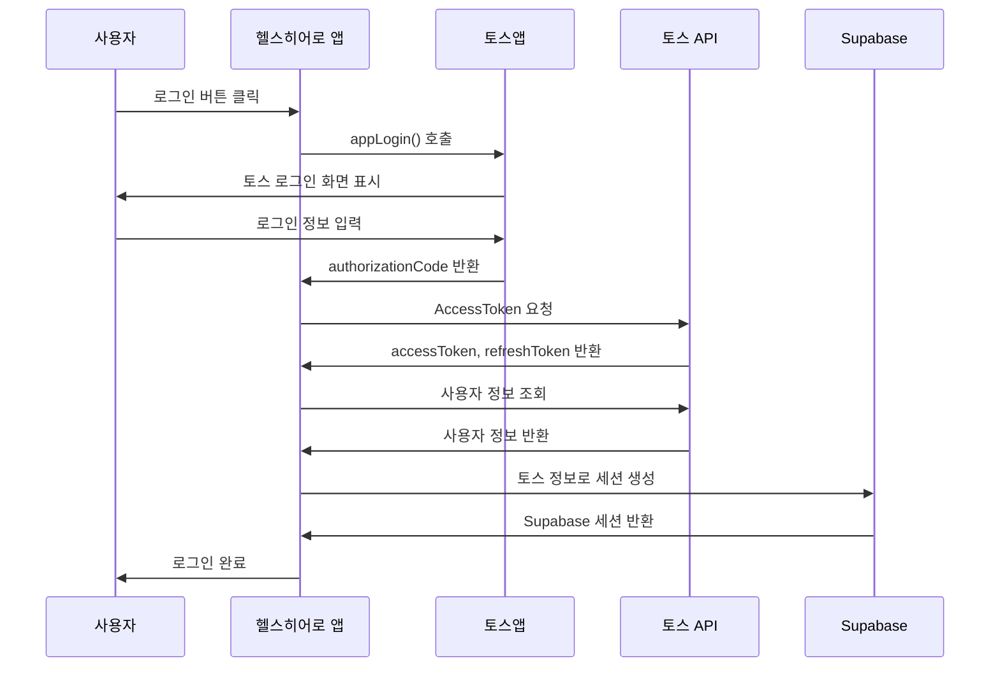

# 🏦 토스 로그인 연동 가이드

**프로젝트**: 헬스 히어로 (Health Hero)  
**목적**: 앱인토스 생태계 내 토스 로그인 시스템 구축  
**기술 스택**: Next.js + Supabase + 앱인토스 SDK

---

## 📋 목차

1. [개요](#개요)
2. [토스 로그인 플로우](#토스-로그인-플로우)
3. [앱인토스 콘솔 설정](#앱인토스-콘솔-설정)
4. [개발 환경 준비](#개발-환경-준비)
5. [토스 로그인 구현](#토스-로그인-구현)
6. [Supabase 연동](#supabase-연동)
7. [토큰 관리](#토큰-관리)
8. [에러 처리](#에러-처리)
9. [테스트 가이드](#테스트-가이드)
10. [배포 및 운영](#배포-및-운영)

---

## 🎯 개요

### 토스 로그인이란?
- **토스앱 사용자**가 별도의 회원가입 없이 토스 계정으로 서비스 이용
- **앱인토스** 생태계 내에서 토스의 인증 시스템 활용
- **OAuth 2.0** 기반의 안전한 인증 프로토콜

### 주요 장점
- ✅ **간편 로그인**: 별도 회원가입 불필요
- ✅ **신뢰성**: 토스의 검증된 인증 시스템
- ✅ **생태계 연동**: 토스 페이, 포인트 등 추가 기능 활용 가능
- ✅ **보안**: OAuth 2.0 기반 안전한 인증

### 프로젝트 적용 범위
- **Phase 2**: 기본 Supabase 인증 (이메일/비밀번호)
- **Phase 3**: 토스 로그인 추가 구현
- **Phase 4**: 토큰 자동 갱신 및 고급 기능

---

## 🔄 토스 로그인 플로우

### 전체 인증 플로우


### 단계별 상세 플로우

#### 1단계: 인가 코드 받기
```typescript
// 앱인토스 SDK 사용
const { authorizationCode, referrer } = await appLogin()

// 반환값
// authorizationCode: 10분 유효한 인가 코드
// referrer: 'sandbox' (개발환경) 또는 'DEFAULT' (프로덕션)
```

#### 2단계: AccessToken 발급
```typescript
const response = await fetch('https://apps-in-toss-api.toss.im/api-partner/v1/apps-in-toss/user/oauth2/generate-token', {
  method: 'POST',
  headers: { 'Content-Type': 'application/json' },
  body: JSON.stringify({
    authorizationCode,
    referrer
  })
})

const data = await response.json()
// data.success.accessToken: 1시간 유효
// data.success.refreshToken: 리프레시 토큰
// data.success.expiresIn: 만료시간(초)
```

#### 3단계: 사용자 정보 조회
```typescript
const userInfo = await fetch('https://apps-in-toss-api.toss.im/api-partner/v1/apps-in-toss/user', {
  headers: { 'Authorization': `Bearer ${accessToken}` }
})

const userData = await userInfo.json()
// userData.success.userKey: 토스 사용자 고유 키
// userData.success.name: 사용자 이름
// userData.success.phone: 전화번호
// userData.success.gender: 성별
// userData.success.birthday: 생년월일
```

---

## ⚙️ 앱인토스 콘솔 설정

### 1. 앱 등록
1. [앱인토스 콘솔](https://developers-apps-in-toss.toss.im/) 접속
2. **새 앱 등록** 클릭
3. 앱 정보 입력:
   - **앱 이름**: 헬스 히어로
   - **카테고리**: 게임
   - **앱 설명**: 의료 상식 퀴즈 게임
   - **이미지**: 앱 아이콘 및 스크린샷

### 2. 토스 로그인 설정
1. **개발** → **토스 로그인** 메뉴 선택
2. **토스 로그인 활성화** 토글 ON
3. **약관 동의 설정**:
   - 필수 약관: 서비스 이용약관, 개인정보 처리방침
   - 선택 약관: 마케팅 정보 수신 동의

### 3. 콜백 URL 설정
```typescript
// 개발환경
https://your-app.supabase.co/auth/v1/callback

// 프로덕션 환경
https://health-hero.vercel.app/auth/callback
```

### 4. 앱 키 발급
- **Client ID**: 토스 API 호출용
- **Client Secret**: 서버 사이드 인증용
- **App Key**: 앱인토스 SDK 사용용

---

## 🛠️ 개발 환경 준비

### 1. 필요한 패키지 설치
```bash
# 앱인토스 SDK
npm install @toss/apps-in-toss-sdk

# 토스 API 호출용 (이미 설치됨)
npm install @supabase/supabase-js
```

### 2. 환경 변수 설정
```bash
# .env.local
NEXT_PUBLIC_TOSS_APP_KEY=your_app_key
TOSS_CLIENT_ID=your_client_id
TOSS_CLIENT_SECRET=your_client_secret
NEXT_PUBLIC_SUPABASE_URL=your_supabase_url
NEXT_PUBLIC_SUPABASE_ANON_KEY=your_supabase_anon_key
```

### 3. 타입 정의
```typescript
// src/types/toss.ts
export interface TossAuthResponse {
  authorizationCode: string
  referrer: 'sandbox' | 'DEFAULT'
}

export interface TossTokenResponse {
  resultType: 'SUCCESS' | 'FAILURE'
  success?: {
    tokenType: 'Bearer'
    accessToken: string
    refreshToken: string
    expiresIn: number
    scope: string
  }
  failure?: {
    errorCode: string
    errorMessage: string
  }
}

export interface TossUserInfo {
  resultType: 'SUCCESS' | 'FAILURE'
  success?: {
    userKey: number
    name: string
    phone: string
    gender: 'MALE' | 'FEMALE'
    birthday: string
    nationality: string
  }
  failure?: {
    errorCode: string
    errorMessage: string
  }
}
```

---

## 💻 토스 로그인 구현

### 1. 토스 로그인 훅 생성
```typescript
// src/hooks/useTossLogin.ts
import { useState } from 'react'
import { TossAuthResponse, TossTokenResponse, TossUserInfo } from '@/types/toss'

export const useTossLogin = () => {
  const [isLoading, setIsLoading] = useState(false)
  const [error, setError] = useState<string | null>(null)

  const tossLogin = async (): Promise<TossAuthResponse> => {
    try {
      // 앱인토스 SDK 로그인
      const result = await appLogin()
      
      if (!result.authorizationCode) {
        throw new Error('인가 코드를 받을 수 없습니다.')
      }
      
      return result
    } catch (error) {
      console.error('토스 로그인 실패:', error)
      throw error
    }
  }

  const getAccessToken = async (authorizationCode: string, referrer: string): Promise<TossTokenResponse> => {
    try {
      const response = await fetch('https://apps-in-toss-api.toss.im/api-partner/v1/apps-in-toss/user/oauth2/generate-token', {
        method: 'POST',
        headers: {
          'Content-Type': 'application/json'
        },
        body: JSON.stringify({
          authorizationCode,
          referrer
        })
      })

      if (!response.ok) {
        throw new Error(`토큰 요청 실패: ${response.status}`)
      }

      return await response.json()
    } catch (error) {
      console.error('액세스 토큰 발급 실패:', error)
      throw error
    }
  }

  const getUserInfo = async (accessToken: string): Promise<TossUserInfo> => {
    try {
      const response = await fetch('https://apps-in-toss-api.toss.im/api-partner/v1/apps-in-toss/user', {
        headers: {
          'Authorization': `Bearer ${accessToken}`,
          'Content-Type': 'application/json'
        }
      })

      if (!response.ok) {
        throw new Error(`사용자 정보 요청 실패: ${response.status}`)
      }

      return await response.json()
    } catch (error) {
      console.error('사용자 정보 조회 실패:', error)
      throw error
    }
  }

  const login = async () => {
    setIsLoading(true)
    setError(null)

    try {
      // 1. 토스 로그인
      const authResult = await tossLogin()
      
      // 2. 액세스 토큰 발급
      const tokenResult = await getAccessToken(
        authResult.authorizationCode,
        authResult.referrer
      )
      
      if (tokenResult.resultType === 'FAILURE') {
        throw new Error(tokenResult.failure?.errorMessage || '토큰 발급 실패')
      }

      // 3. 사용자 정보 조회
      const userResult = await getUserInfo(tokenResult.success!.accessToken)
      
      if (userResult.resultType === 'FAILURE') {
        throw new Error(userResult.failure?.errorMessage || '사용자 정보 조회 실패')
      }

      return {
        auth: authResult,
        token: tokenResult.success!,
        user: userResult.success!
      }
    } catch (error) {
      const errorMessage = error instanceof Error ? error.message : '알 수 없는 오류'
      setError(errorMessage)
      throw error
    } finally {
      setIsLoading(false)
    }
  }

  return {
    login,
    isLoading,
    error
  }
}
```

### 2. 토스 로그인 컴포넌트
```typescript
// src/components/auth/TossLoginButton.tsx
import { useTossLogin } from '@/hooks/useTossLogin'
import { Button } from '@/components/ui/Button'

interface TossLoginButtonProps {
  onSuccess?: (result: any) => void
  onError?: (error: string) => void
}

export const TossLoginButton = ({ onSuccess, onError }: TossLoginButtonProps) => {
  const { login, isLoading, error } = useTossLogin()

  const handleLogin = async () => {
    try {
      const result = await login()
      onSuccess?.(result)
    } catch (error) {
      const errorMessage = error instanceof Error ? error.message : '로그인 실패'
      onError?.(errorMessage)
    }
  }

  return (
    <Button
      onClick={handleLogin}
      disabled={isLoading}
      className="bg-[#3182F6] text-white hover:bg-[#2C5FCC]"
    >
      {isLoading ? '로그인 중...' : '토스로 로그인'}
    </Button>
  )
}
```

---

## 🔗 Supabase 연동

### 1. 데이터베이스 스키마 설계
```sql
-- 사용자 프로필 테이블 (토스 정보 포함)
CREATE TABLE user_profiles (
  id UUID REFERENCES auth.users(id) PRIMARY KEY,
  email TEXT,
  name TEXT,
  phone TEXT,
  gender TEXT,
  birthday DATE,
  nationality TEXT,
  
  -- 토스 관련 필드
  toss_user_key BIGINT UNIQUE,
  toss_access_token TEXT,
  toss_refresh_token TEXT,
  toss_token_expires_at TIMESTAMP WITH TIME ZONE,
  toss_referrer TEXT,
  
  -- 게임 관련 필드
  level INTEGER DEFAULT 1,
  current_exp INTEGER DEFAULT 0,
  total_score INTEGER DEFAULT 0,
  current_streak INTEGER DEFAULT 0,
  current_stage INTEGER DEFAULT 1,
  current_phase INTEGER DEFAULT 1,
  
  created_at TIMESTAMP WITH TIME ZONE DEFAULT NOW(),
  updated_at TIMESTAMP WITH TIME ZONE DEFAULT NOW()
);

-- 토스 로그인 기록
CREATE TABLE toss_login_logs (
  id UUID DEFAULT gen_random_uuid() PRIMARY KEY,
  user_id UUID REFERENCES auth.users(id),
  toss_user_key BIGINT,
  referrer TEXT,
  login_at TIMESTAMP WITH TIME ZONE DEFAULT NOW(),
  ip_address INET,
  user_agent TEXT
);

-- Row Level Security 설정
ALTER TABLE user_profiles ENABLE ROW LEVEL SECURITY;
ALTER TABLE toss_login_logs ENABLE ROW LEVEL SECURITY;

-- 정책 설정
CREATE POLICY "Users can view own profile" ON user_profiles
  FOR SELECT USING (auth.uid() = id);

CREATE POLICY "Users can update own profile" ON user_profiles
  FOR UPDATE USING (auth.uid() = id);

CREATE POLICY "Users can insert own profile" ON user_profiles
  FOR INSERT WITH CHECK (auth.uid() = id);
```

### 2. Supabase 연동 서비스
```typescript
// src/services/tossSupabaseService.ts
import { supabase } from '@/lib/supabase'

export class TossSupabaseService {
  // 토스 정보로 Supabase 사용자 생성/로그인
  static async createOrUpdateUser(tossData: {
    userKey: number
    name: string
    phone: string
    gender: string
    birthday: string
    nationality: string
    accessToken: string
    refreshToken: string
    expiresIn: number
    referrer: string
  }) {
    const email = `${tossData.userKey}@toss.im`
    const password = `toss_${tossData.userKey}_${Date.now()}`

    try {
      // 1. Supabase 사용자 생성/로그인
      const { data: authData, error: authError } = await supabase.auth.signUp({
        email,
        password,
        options: {
          data: {
            toss_user_key: tossData.userKey,
            name: tossData.name,
            phone: tossData.phone
          }
        }
      })

      if (authError && authError.message !== 'User already registered') {
        throw authError
      }

      // 2. 사용자 프로필 업데이트/생성
      const tokenExpiresAt = new Date(Date.now() + tossData.expiresIn * 1000)
      
      const { data: profileData, error: profileError } = await supabase
        .from('user_profiles')
        .upsert({
          id: authData.user?.id,
          email,
          name: tossData.name,
          phone: tossData.phone,
          gender: tossData.gender,
          birthday: tossData.birthday,
          nationality: tossData.nationality,
          toss_user_key: tossData.userKey,
          toss_access_token: tossData.accessToken,
          toss_refresh_token: tossData.refreshToken,
          toss_token_expires_at: tokenExpiresAt,
          toss_referrer: tossData.referrer,
          updated_at: new Date().toISOString()
        })
        .select()

      if (profileError) {
        throw profileError
      }

      // 3. 로그인 기록 저장
      await supabase
        .from('toss_login_logs')
        .insert({
          user_id: authData.user?.id,
          toss_user_key: tossData.userKey,
          referrer: tossData.referrer,
          ip_address: null, // 클라이언트에서는 null
          user_agent: navigator.userAgent
        })

      return {
        user: authData.user,
        session: authData.session,
        profile: profileData?.[0]
      }
    } catch (error) {
      console.error('Supabase 사용자 생성/업데이트 실패:', error)
      throw error
    }
  }

  // 토스 사용자 정보로 기존 사용자 찾기
  static async findUserByTossKey(tossUserKey: number) {
    const { data, error } = await supabase
      .from('user_profiles')
      .select('*')
      .eq('toss_user_key', tossUserKey)
      .single()

    if (error && error.code !== 'PGRST116') {
      throw error
    }

    return data
  }
}
```

### 3. 통합 로그인 서비스
```typescript
// src/services/authService.ts
import { useTossLogin } from '@/hooks/useTossLogin'
import { TossSupabaseService } from './tossSupabaseService'

export class AuthService {
  // 토스 로그인 + Supabase 연동
  static async loginWithToss() {
    const { login } = useTossLogin()
    
    try {
      // 1. 토스 로그인
      const tossResult = await login()
      
      // 2. Supabase 사용자 생성/업데이트
      const supabaseResult = await TossSupabaseService.createOrUpdateUser({
        userKey: tossResult.user.userKey,
        name: tossResult.user.name,
        phone: tossResult.user.phone,
        gender: tossResult.user.gender,
        birthday: tossResult.user.birthday,
        nationality: tossResult.user.nationality,
        accessToken: tossResult.token.accessToken,
        refreshToken: tossResult.token.refreshToken,
        expiresIn: tossResult.token.expiresIn,
        referrer: tossResult.auth.referrer
      })

      return {
        toss: tossResult,
        supabase: supabaseResult
      }
    } catch (error) {
      console.error('토스 로그인 실패:', error)
      throw error
    }
  }

  // 로그아웃
  static async logout() {
    try {
      // Supabase 로그아웃
      await supabase.auth.signOut()
      
      // 토스 토큰 무효화 (선택사항)
      // await this.invalidateTossToken()
    } catch (error) {
      console.error('로그아웃 실패:', error)
      throw error
    }
  }
}
```

---

## 🔐 토큰 관리

### 1. 토큰 저장 및 관리
```typescript
// src/utils/tokenManager.ts
export class TokenManager {
  private static readonly ACCESS_TOKEN_KEY = 'toss_access_token'
  private static readonly REFRESH_TOKEN_KEY = 'toss_refresh_token'
  private static readonly EXPIRES_AT_KEY = 'toss_expires_at'

  // 토큰 저장
  static saveTokens(accessToken: string, refreshToken: string, expiresIn: number) {
    const expiresAt = Date.now() + (expiresIn * 1000)
    
    localStorage.setItem(this.ACCESS_TOKEN_KEY, accessToken)
    localStorage.setItem(this.REFRESH_TOKEN_KEY, refreshToken)
    localStorage.setItem(this.EXPIRES_AT_KEY, expiresAt.toString())
  }

  // 토큰 조회
  static getAccessToken(): string | null {
    return localStorage.getItem(this.ACCESS_TOKEN_KEY)
  }

  static getRefreshToken(): string | null {
    return localStorage.getItem(this.REFRESH_TOKEN_KEY)
  }

  // 토큰 만료 확인
  static isTokenExpired(): boolean {
    const expiresAt = localStorage.getItem(this.EXPIRES_AT_KEY)
    if (!expiresAt) return true
    
    return Date.now() >= parseInt(expiresAt)
  }

  // 토큰 갱신
  static async refreshAccessToken(): Promise<string> {
    const refreshToken = this.getRefreshToken()
    if (!refreshToken) {
      throw new Error('리프레시 토큰이 없습니다.')
    }

    try {
      const response = await fetch('https://apps-in-toss-api.toss.im/api-partner/v1/apps-in-toss/user/oauth2/refresh-token', {
        method: 'POST',
        headers: {
          'Content-Type': 'application/json'
        },
        body: JSON.stringify({
          refreshToken
        })
      })

      const data = await response.json()
      
      if (data.resultType === 'FAILURE') {
        throw new Error(data.failure?.errorMessage || '토큰 갱신 실패')
      }

      // 새 토큰 저장
      this.saveTokens(
        data.success.accessToken,
        data.success.refreshToken,
        data.success.expiresIn
      )

      return data.success.accessToken
    } catch (error) {
      console.error('토큰 갱신 실패:', error)
      // 토큰 갱신 실패 시 로그인 페이지로 리다이렉트
      this.clearTokens()
      window.location.href = '/login'
      throw error
    }
  }

  // 토큰 삭제
  static clearTokens() {
    localStorage.removeItem(this.ACCESS_TOKEN_KEY)
    localStorage.removeItem(this.REFRESH_TOKEN_KEY)
    localStorage.removeItem(this.EXPIRES_AT_KEY)
  }

  // 자동 토큰 갱신
  static startAutoRefresh() {
    setInterval(async () => {
      if (this.isTokenExpired()) {
        try {
          await this.refreshAccessToken()
          console.log('토큰이 자동으로 갱신되었습니다.')
        } catch (error) {
          console.error('자동 토큰 갱신 실패:', error)
        }
      }
    }, 5 * 60 * 1000) // 5분마다 확인
  }
}
```

### 2. 토큰 자동 갱신 훅
```typescript
// src/hooks/useTokenRefresh.ts
import { useEffect } from 'react'
import { TokenManager } from '@/utils/tokenManager'

export const useTokenRefresh = () => {
  useEffect(() => {
    // 컴포넌트 마운트 시 자동 갱신 시작
    TokenManager.startAutoRefresh()

    // 컴포넌트 언마운트 시 정리
    return () => {
      // 인터벌 정리는 TokenManager에서 처리
    }
  }, [])

  const refreshToken = async () => {
    try {
      const newToken = await TokenManager.refreshAccessToken()
      return newToken
    } catch (error) {
      console.error('토큰 갱신 실패:', error)
      throw error
    }
  }

  return { refreshToken }
}
```

---

## ⚠️ 에러 처리

### 1. 에러 타입 정의
```typescript
// src/types/errors.ts
export enum TossErrorCode {
  // 인증 관련
  INVALID_AUTHORIZATION_CODE = 'INVALID_AUTHORIZATION_CODE',
  EXPIRED_AUTHORIZATION_CODE = 'EXPIRED_AUTHORIZATION_CODE',
  INVALID_ACCESS_TOKEN = 'INVALID_ACCESS_TOKEN',
  EXPIRED_ACCESS_TOKEN = 'EXPIRED_ACCESS_TOKEN',
  INVALID_REFRESH_TOKEN = 'INVALID_REFRESH_TOKEN',
  EXPIRED_REFRESH_TOKEN = 'EXPIRED_REFRESH_TOKEN',
  
  // 사용자 관련
  USER_NOT_FOUND = 'USER_NOT_FOUND',
  USER_ALREADY_EXISTS = 'USER_ALREADY_EXISTS',
  INSUFFICIENT_PERMISSIONS = 'INSUFFICIENT_PERMISSIONS',
  
  // 시스템 관련
  INTERNAL_SERVER_ERROR = 'INTERNAL_SERVER_ERROR',
  NETWORK_ERROR = 'NETWORK_ERROR',
  UNKNOWN_ERROR = 'UNKNOWN_ERROR'
}

export interface TossError {
  code: TossErrorCode
  message: string
  details?: any
}
```

### 2. 에러 핸들러
```typescript
// src/utils/errorHandler.ts
import { TossError, TossErrorCode } from '@/types/errors'

export class ErrorHandler {
  static handleTossError(error: any): TossError {
    // 토스 API 에러 처리
    if (error?.failure) {
      return {
        code: this.mapTossErrorCode(error.failure.errorCode),
        message: error.failure.errorMessage,
        details: error.failure
      }
    }

    // 네트워크 에러 처리
    if (error instanceof TypeError && error.message.includes('fetch')) {
      return {
        code: TossErrorCode.NETWORK_ERROR,
        message: '네트워크 연결을 확인해주세요.',
        details: error
      }
    }

    // 알 수 없는 에러
    return {
      code: TossErrorCode.UNKNOWN_ERROR,
      message: error?.message || '알 수 없는 오류가 발생했습니다.',
      details: error
    }
  }

  private static mapTossErrorCode(tossCode: string): TossErrorCode {
    const errorMap: Record<string, TossErrorCode> = {
      'INVALID_AUTHORIZATION_CODE': TossErrorCode.INVALID_AUTHORIZATION_CODE,
      'EXPIRED_AUTHORIZATION_CODE': TossErrorCode.EXPIRED_AUTHORIZATION_CODE,
      'INVALID_ACCESS_TOKEN': TossErrorCode.INVALID_ACCESS_TOKEN,
      'EXPIRED_ACCESS_TOKEN': TossErrorCode.EXPIRED_ACCESS_TOKEN,
      'INVALID_REFRESH_TOKEN': TossErrorCode.INVALID_REFRESH_TOKEN,
      'EXPIRED_REFRESH_TOKEN': TossErrorCode.EXPIRED_REFRESH_TOKEN,
      'USER_NOT_FOUND': TossErrorCode.USER_NOT_FOUND,
      'INTERNAL_SERVER_ERROR': TossErrorCode.INTERNAL_SERVER_ERROR
    }

    return errorMap[tossCode] || TossErrorCode.UNKNOWN_ERROR
  }

  static getErrorMessage(error: TossError): string {
    const errorMessages: Record<TossErrorCode, string> = {
      [TossErrorCode.INVALID_AUTHORIZATION_CODE]: '유효하지 않은 인가 코드입니다.',
      [TossErrorCode.EXPIRED_AUTHORIZATION_CODE]: '인가 코드가 만료되었습니다. 다시 로그인해주세요.',
      [TossErrorCode.INVALID_ACCESS_TOKEN]: '유효하지 않은 액세스 토큰입니다.',
      [TossErrorCode.EXPIRED_ACCESS_TOKEN]: '액세스 토큰이 만료되었습니다.',
      [TossErrorCode.INVALID_REFRESH_TOKEN]: '유효하지 않은 리프레시 토큰입니다.',
      [TossErrorCode.EXPIRED_REFRESH_TOKEN]: '리프레시 토큰이 만료되었습니다. 다시 로그인해주세요.',
      [TossErrorCode.USER_NOT_FOUND]: '사용자를 찾을 수 없습니다.',
      [TossErrorCode.USER_ALREADY_EXISTS]: '이미 존재하는 사용자입니다.',
      [TossErrorCode.INSUFFICIENT_PERMISSIONS]: '권한이 부족합니다.',
      [TossErrorCode.INTERNAL_SERVER_ERROR]: '서버 오류가 발생했습니다. 잠시 후 다시 시도해주세요.',
      [TossErrorCode.NETWORK_ERROR]: '네트워크 연결을 확인해주세요.',
      [TossErrorCode.UNKNOWN_ERROR]: '알 수 없는 오류가 발생했습니다.'
    }

    return errorMessages[error.code] || error.message
  }
}
```

### 3. 에러 바운더리
```typescript
// src/components/ErrorBoundary.tsx
import React, { Component, ErrorInfo, ReactNode } from 'react'
import { ErrorHandler, TossError } from '@/utils/errorHandler'

interface Props {
  children: ReactNode
  fallback?: ReactNode
}

interface State {
  hasError: boolean
  error?: TossError
}

export class TossErrorBoundary extends Component<Props, State> {
  constructor(props: Props) {
    super(props)
    this.state = { hasError: false }
  }

  static getDerivedStateFromError(error: Error): State {
    return {
      hasError: true,
      error: ErrorHandler.handleTossError(error)
    }
  }

  componentDidCatch(error: Error, errorInfo: ErrorInfo) {
    console.error('토스 로그인 에러:', error, errorInfo)
    
    // 에러 로깅 서비스로 전송 (선택사항)
    // this.logErrorToService(error, errorInfo)
  }

  render() {
    if (this.state.hasError) {
      return this.props.fallback || (
        <div className="error-boundary">
          <h2>로그인 중 오류가 발생했습니다</h2>
          <p>{this.state.error ? ErrorHandler.getErrorMessage(this.state.error) : '알 수 없는 오류'}</p>
          <button onClick={() => this.setState({ hasError: false })}>
            다시 시도
          </button>
        </div>
      )
    }

    return this.props.children
  }
}
```

---

## 🧪 테스트 가이드

### 1. 개발 환경 테스트
```typescript
// src/utils/testHelpers.ts
export class TossTestHelper {
  // 샌드박스 환경 확인
  static isSandbox(): boolean {
    return process.env.NODE_ENV === 'development'
  }

  // 테스트용 더미 데이터
  static getDummyTossUser() {
    return {
      userKey: 123456789,
      name: '테스트 사용자',
      phone: '01012345678',
      gender: 'MALE' as const,
      birthday: '19900101',
      nationality: 'KR'
    }
  }

  // 모의 토스 API 응답
  static getMockTossResponse() {
    return {
      resultType: 'SUCCESS' as const,
      success: {
        tokenType: 'Bearer' as const,
        accessToken: 'mock_access_token',
        refreshToken: 'mock_refresh_token',
        expiresIn: 3600,
        scope: 'user_ci user_birthday user_nationality user_name user_phone user_gender'
      }
    }
  }
}
```

### 2. 단위 테스트
```typescript
// src/__tests__/hooks/useTossLogin.test.ts
import { renderHook, act } from '@testing-library/react'
import { useTossLogin } from '@/hooks/useTossLogin'

describe('useTossLogin', () => {
  beforeEach(() => {
    // 모의 함수 설정
    global.appLogin = jest.fn()
    global.fetch = jest.fn()
  })

  afterEach(() => {
    jest.clearAllMocks()
  })

  it('토스 로그인이 성공적으로 처리되어야 함', async () => {
    // Given
    const mockAuthResponse = { authorizationCode: 'test_code', referrer: 'sandbox' }
    const mockTokenResponse = TossTestHelper.getMockTossResponse()
    const mockUserResponse = {
      resultType: 'SUCCESS',
      success: TossTestHelper.getDummyTossUser()
    }

    global.appLogin.mockResolvedValue(mockAuthResponse)
    global.fetch
      .mockResolvedValueOnce({
        ok: true,
        json: () => Promise.resolve(mockTokenResponse)
      })
      .mockResolvedValueOnce({
        ok: true,
        json: () => Promise.resolve(mockUserResponse)
      })

    // When
    const { result } = renderHook(() => useTossLogin())
    
    await act(async () => {
      await result.current.login()
    })

    // Then
    expect(result.current.error).toBeNull()
    expect(global.appLogin).toHaveBeenCalledTimes(1)
    expect(global.fetch).toHaveBeenCalledTimes(2)
  })

  it('토스 로그인 실패 시 에러가 설정되어야 함', async () => {
    // Given
    global.appLogin.mockRejectedValue(new Error('로그인 실패'))

    // When
    const { result } = renderHook(() => useTossLogin())
    
    await act(async () => {
      try {
        await result.current.login()
      } catch (error) {
        // 에러는 예상된 것
      }
    })

    // Then
    expect(result.current.error).toBeTruthy()
  })
})
```

### 3. 통합 테스트
```typescript
// src/__tests__/integration/tossLogin.test.ts
import { render, screen, fireEvent, waitFor } from '@testing-library/react'
import { TossLoginButton } from '@/components/auth/TossLoginButton'

describe('토스 로그인 통합 테스트', () => {
  it('토스 로그인 버튼 클릭 시 전체 플로우가 정상 작동해야 함', async () => {
    // Given
    const mockOnSuccess = jest.fn()
    const mockOnError = jest.fn()

    // 모의 설정
    global.appLogin = jest.fn().mockResolvedValue({
      authorizationCode: 'test_code',
      referrer: 'sandbox'
    })

    // When
    render(
      <TossLoginButton 
        onSuccess={mockOnSuccess} 
        onError={mockOnError} 
      />
    )

    const loginButton = screen.getByText('토스로 로그인')
    fireEvent.click(loginButton)

    // Then
    await waitFor(() => {
      expect(mockOnSuccess).toHaveBeenCalled()
    })
  })
})
```

---

## 🚀 배포 및 운영

### 1. 환경별 설정
```typescript
// src/config/toss.ts
interface TossConfig {
  appKey: string
  clientId: string
  clientSecret: string
  baseUrl: string
  redirectUri: string
}

export const tossConfig: Record<string, TossConfig> = {
  development: {
    appKey: process.env.NEXT_PUBLIC_TOSS_APP_KEY_DEV || '',
    clientId: process.env.TOSS_CLIENT_ID_DEV || '',
    clientSecret: process.env.TOSS_CLIENT_SECRET_DEV || '',
    baseUrl: 'https://apps-in-toss-api.toss.im',
    redirectUri: 'https://your-dev-app.supabase.co/auth/v1/callback'
  },
  production: {
    appKey: process.env.NEXT_PUBLIC_TOSS_APP_KEY || '',
    clientId: process.env.TOSS_CLIENT_ID || '',
    clientSecret: process.env.TOSS_CLIENT_SECRET || '',
    baseUrl: 'https://apps-in-toss-api.toss.im',
    redirectUri: 'https://health-hero.vercel.app/auth/callback'
  }
}

export const getTossConfig = (): TossConfig => {
  const env = process.env.NODE_ENV || 'development'
  return tossConfig[env]
}
```

### 2. 프로덕션 환경 변수
```bash
# .env.production
NEXT_PUBLIC_TOSS_APP_KEY=prod_app_key
TOSS_CLIENT_ID=prod_client_id
TOSS_CLIENT_SECRET=prod_client_secret
NEXT_PUBLIC_SUPABASE_URL=prod_supabase_url
NEXT_PUBLIC_SUPABASE_ANON_KEY=prod_supabase_anon_key
```

### 3. 모니터링 설정
```typescript
// src/utils/monitoring.ts
export class TossMonitoring {
  // 로그인 성공률 추적
  static trackLoginSuccess(userKey: number, referrer: string) {
    // 분석 도구로 이벤트 전송
    if (typeof window !== 'undefined' && window.gtag) {
      window.gtag('event', 'toss_login_success', {
        user_key: userKey,
        referrer: referrer,
        timestamp: new Date().toISOString()
      })
    }
  }

  // 로그인 실패 추적
  static trackLoginFailure(error: TossError) {
    if (typeof window !== 'undefined' && window.gtag) {
      window.gtag('event', 'toss_login_failure', {
        error_code: error.code,
        error_message: error.message,
        timestamp: new Date().toISOString()
      })
    }
  }

  // 토큰 갱신 추적
  static trackTokenRefresh(success: boolean, error?: string) {
    if (typeof window !== 'undefined' && window.gtag) {
      window.gtag('event', 'toss_token_refresh', {
        success: success,
        error: error || null,
        timestamp: new Date().toISOString()
      })
    }
  }
}
```

### 4. 성능 최적화
```typescript
// src/utils/performance.ts
export class TossPerformance {
  // 토큰 갱신 최적화
  static async optimizedTokenRefresh(): Promise<string> {
    const startTime = performance.now()
    
    try {
      const newToken = await TokenManager.refreshAccessToken()
      const endTime = performance.now()
      
      // 성능 메트릭 기록
      console.log(`토큰 갱신 시간: ${endTime - startTime}ms`)
      
      return newToken
    } catch (error) {
      const endTime = performance.now()
      console.error(`토큰 갱신 실패 (${endTime - startTime}ms):`, error)
      throw error
    }
  }

  // 배치 요청 최적화
  static async batchTokenRefresh(userKeys: number[]): Promise<Record<number, string>> {
    const promises = userKeys.map(async (userKey) => {
      try {
        const token = await this.refreshTokenForUser(userKey)
        return { userKey, token }
      } catch (error) {
        return { userKey, error }
      }
    })

    const results = await Promise.allSettled(promises)
    const tokenMap: Record<number, string> = {}

    results.forEach((result, index) => {
      if (result.status === 'fulfilled' && !result.value.error) {
        tokenMap[result.value.userKey] = result.value.token
      }
    })

    return tokenMap
  }
}
```

---

## 📚 참고 자료

### 공식 문서
- [앱인토스 개발자 가이드](https://developers-apps-in-toss.toss.im/)
- [토스 로그인 개발 문서](https://developers-apps-in-toss.toss.im/login/develop.html)
- [Supabase 인증 문서](https://supabase.com/docs/guides/auth)

### 유용한 링크
- [OAuth 2.0 RFC](https://tools.ietf.org/html/rfc6749)
- [JWT 토큰 디버거](https://jwt.io/)
- [토스 API 테스트 도구](https://developers.toss.im/)

### 커뮤니티
- [앱인토스 개발자 커뮤니티](https://developers-apps-in-toss.toss.im/community)
- [Supabase 한국 커뮤니티](https://discord.gg/supabase)

---

## 🔄 업데이트 이력

### v1.0.0 (2024-01-XX)
- 초기 토스 로그인 연동 가이드 작성
- 기본 인증 플로우 구현
- Supabase 연동 방법 추가

### v1.1.0 (예정)
- 토큰 자동 갱신 기능 추가
- 에러 처리 고도화
- 테스트 코드 추가

### v1.2.0 (예정)
- 성능 최적화
- 모니터링 시스템 구축
- 보안 강화

---

**Last Updated**: 2024-01-XX  
**Version**: 1.0.0  
**Maintainer**: Health Hero Development Team
